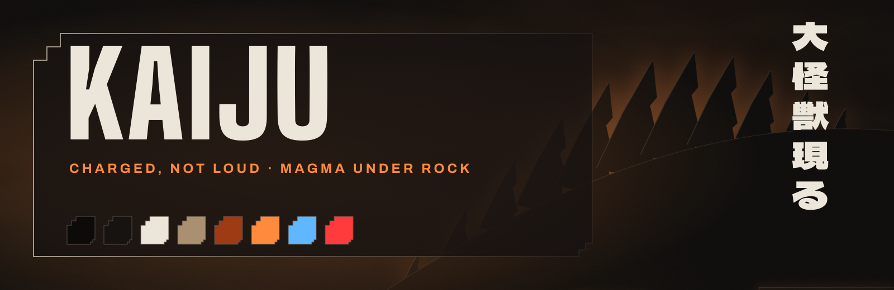

<p align="center"></p>

<p align="center"><sub>大怪獣現る daikaijū arawaru<br>
嵐の前の静けさ arashi no mae no shizukesa<br>
動かざること山の如し ugokazaru koto yama no gotoshi</sub></p>

# ▗▟ KAIJU

Charged, not loud. A Charcoal ground broken into terraced plates; edges cold and quiet, a 1px line from ash to stone that fades. The only light is **Magma**, behind the one thing that matters: the focused window, the bar, the adhan banner, the lock clock. Nothing pulses.

## ▗▟ Specimen

| | | |
|---|---|---|
| **Charcoal** | `#0C0B0A` | the ground |
| **Slag** | `#161311` | plates |
| **Ash** | `#ECE6DA` | text, edges |
| **Ochre** | `#A89070` | quiet text |
| **Ember** | `#9E3B14` | structure |
| **Magma** | `#FF8A3D` | attention, light |
| **Spine** | `#5FB8FF` | small data |
| **Blaze** | `#FF3B3B` | failure |

## ▗▟ Anatomy

- **Windows**: sharp, the magma glow on the focused one only; `kaiju-corners` paints
  the 12/6 terrace over the corners of tiled windows (`kaiju-corners off|on|status`)
- **Waybar**: three Slag plates with the terrace and sawtooth ends; plate workspaces
  ▲ △
- **mawaqit**: a terraced banner; an outlined plate in magma glow for the adhan,
  a filled, cracked plate for the iqama
- **yawm**: Magma when due, a Blaze block when overdue
- **hyprlock**: a Big Shoulders clock with the glow, the saying in vertical Dela
  Gothic One with three plates lit from behind; no username
- **KaijuClaw** cursor, **Kaiju** icons, **GTK / Thunar** (terraced menus),
  **swaync** (terraced cards)
- **Terminals**: Red Hat Mono 10.5; tmux and the zsh prompt open every block with
  ▗▟ and close it with ▛▘
- **Type**: Big Shoulders Display, Dela Gothic One, Archivo, Red Hat Mono, Cairo

## ▗▟ Habitat

- Arch Linux (the package check uses `pacman`)
- Hyprland 0.56 or newer: the configuration is written in Lua
- waybar 0.15 or newer
- the packages in `kaiju/packages.txt`:

```sh
sudo pacman -S --needed $(grep -v '^#' kaiju/packages.txt)
```

## ▗▟ Release

> [!WARNING]
> This is a whole desktop, not a colour scheme. It replaces every file listed
> in `kaiju/MANIFEST`: the Hyprland, waybar, terminal, tmux, GTK and fontconfig
> configuration among them, and the theme line in `~/.zshrc`.
> Everything it replaces is backed up first.

```sh
git clone https://github.com/houssemMekhelbi/hattin-kaiju.git
cd hattin-kaiju
./kaiju/restore.sh --dry-run   # show what would change, touch nothing
./kaiju/restore.sh             # apply
```

`restore.sh` then:

1. reports missing packages;
2. backs up every path it is about to replace to `~/themes/.backups/before-kaiju-<timestamp>/`;
3. copies the theme's `home/` over `$HOME` and removes the paths in its `ABSENT`;
4. points `~/.zshrc` at the theme's prompt;
5. applies its `gsettings.txt` and refreshes the font and icon caches;
6. builds the mawaqit-api image if it is missing, enables the user services and
   reloads Hyprland, waybar, hyprpaper, swaync and tmux.

`--files-only` copies the files and gsettings and leaves the services alone.

## ▗▟ Containment

Copy the backup folder back over `$HOME`.

## ▗▟ Prayer times

Prayer times come from [mawaqit.net](https://mawaqit.net) through a local copy of
[mawaqit-api](https://github.com/mrsofiane/mawaqit-api), run by podman on 127.0.0.1.
List your mosques in `~/.config/mawaqit/mosques`, one `<mawaqit.net slug> | <label>`
per line; scroll or right-click the prayer module to switch between them.

## ▗▟ Other sightings

This is one of the hattin themes. They share one behaviour (binds, workspaces,
bar modules) and differ only in look. Clone several side by side and run the
`restore.sh` of the one you want: each switch removes what the previous theme
left that the new one does not use.

## ▗▟ Licence

MIT, see [LICENSE](LICENSE). The fonts in `<theme>/home/.local/share/fonts/` are
under the SIL Open Font License; each licence text sits next to its font.
mawaqit-api (`<theme>/home/.local/share/mawaqit-api/`) is MIT, © Sofiane Louchene.
